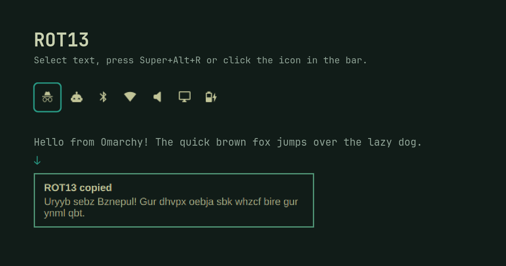

# omarot13

Omarchy shell plugin (`io.github.han-rucan.omarot13`) that ROT13s text.



- **Bar button**: left click rotates the selected text (falls back to the clipboard), right click rotates the clipboard. The result goes to the clipboard, with a notification.
- **Script**: `bin/omarot13 [--selection | --clipboard]`, usable from anywhere.

## Install

```bash
omarchy plugin add https://github.com/han-rucan/omarot13.git --enable
```

Then add the keybindings below if you want them.

## Requirements

Omarchy 4.x. The script uses `wl-clipboard` (`wl-paste`, `wl-copy`),
`libnotify` (`notify-send`) and coreutils `tr`, all standard on Omarchy.
Nothing else is installed and no configuration is changed.

## Remove

```bash
omarchy plugin remove io.github.han-rucan.omarot13
```

If you copied the keybindings, delete the ROT13 block from
`~/.config/hypr/bindings.lua`.

## Development

The shell hot-reloads plugins with `inotifywait -r`, which does not follow
symlinks, so the real directory must live under `~/.config/omarchy/plugins/`
and the project dir links to it:

```bash
mv ~/Projects/omarot13 ~/.config/omarchy/plugins/io.github.han-rucan.omarot13
ln -s ~/.config/omarchy/plugins/io.github.han-rucan.omarot13 ~/Projects/omarot13
omarchy-shell shell rescanPlugins
omarchy plugin enable io.github.han-rucan.omarot13
omarchy plugin validate .
```

Saving a file triggers a reload, but Qt keeps serving the cached component
while the old widget is alive, so QML changes may only show after
`omarchy restart shell`.

## Keybindings

Copy [`examples/bindings.lua`](examples/bindings.lua) into `~/.config/hypr/bindings.lua`:

| Keys | Action |
|------|--------|
| `SUPER + ALT + R` | ROT13 the selection and paste it over itself (clipboard only in terminals) |
| `SUPER + ALT + SHIFT + R` | ROT13 the selection or the clipboard into the clipboard |
